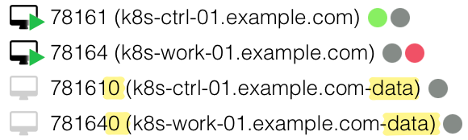

# Virtual Machines in Proxmox VE

## VM handling

### Integrated configuration of the cluster and its base infrastructure

VMs get created in Proxmox according to their configuration using the [`nodes` variable](variables.md#nodes). By adding (or removing) elements to the `nodes` variable, VMs get created (or removed) in Proxmox while at the same time control plane or worker nodes get added/removed in the Kubernetes cluster automatically.

A **cluster health check** (`module.talos.data.talos_cluster_health.this`) is part of the configuration process and waits for its successful termination. Hence, you can start the next action safely once terraform/tofu processes a configuration change successfully.

You need to implement additional health checks for other aspects of the cluster as the cluster health check is only verifying the health of the Kubernetes control plane, especially `etcd`.  It is not checking on health of worker nodes or deployed workloads, especially replication state for databases and storage.

### Changes affecting the cluster

Some configuration changes (e.g. changing count of CPU cores or amount of memory) require a **reboot** of the VM. Hence, take care of not putting too many nodes offline at the same time when changing a parameter applicable for multiple VMs. This can be done by changing the parameter only for one VM step-by-step or use [resource targeting](https://developer.hashicorp.com/terraform/tutorials/state/resource-targeting).

### Cluster Upgrades

A special case is upgrading the cluster and its nodes which is [documented here](upgrading.md).

## Separation of Talos VM and Data VM

For each Kubernetes node two VMs will get created:

1. **Main/Talos VM** is holding primary disk with Talos OS (with EFI, META and STATE) partitions. The disk has a fixed size of `5 GB` because current Talos image size is ~4 GB.

2. **Data VM** is having at minimum one disk for EPHEMERAL data (with e.g. `etcd`) and possibly additional disks when configured in the [`volumes` variable](variables.md#volumes).

   This "data_vm" is **offline** and just acts as a placeholder to be able having the disks separated from the main Talos VM. Thus, it does not consume any resources in terms of CPU and memory defined.

   All **disks** belonging to the data VM are **attached to the main Talos VM** to be consumed there as they would belong to the Talos VM.

   The **VM ID** is the Talos VM ID suffixed by `0`, and the **VM name** is suffixed by `-data` (e.g. VM ID `123` and VM name `host.example.com` become `1230` and `host.example.com-data`, respectively).  The data disk has a variable size which is configurable.

### Additional Disk Configuration

You can define additional disks for the data VM (besides the EPHEMERAL disk) by using the [`volumes` variable](variables.md#volumes) and the `disk` volume `type`. Each volume defined there will get created as an additional disk on the data VM, and thus attached to the main Talos VM.

```terraform
volumes = {
  # additional data disk mounted at /var/mnt/example inside Talos OS
  example = {
     size = "7GB"
     type = "disk"
  }
}
```

### Visual Representation in Proxmox VE

The following picture shows two main Talos VMs (with VM IDs 78161 and 78164) and their data VMs counterparts (IDs 78161**0** and 78164**0** suffixed with **0**) holding EPHEMERAL and optional data disks.



#### Data VM View

The Hardware view in Proxmox of the **data VM** shows the disk configuration with the `scsi0` disk forming the EPHEMERAL (`/var`) space and an additional `scsi1` disk for additional data mounted at `/var/mnt/<volume name>` (cf. [`volumes` variable documentation](variables.md#volumes)).


#### Main/Talos VM View

The data VM's disks are **attached** to the **main Talos VM** as additional disks (starting with `scsi1`, while the Talos OS disk is `scsi0`), so that Talos can consume them as if they would belong to the Talos VM itself.


### Talos View

The Talos OS **sees all disks** (the Talos OS disk and the data VM's disks) when querying the disks using `talosctl`:

The Talos OS disk is `sda`, the EPHEMERAL disk is `sdb`, and the additional data disk is `sdc`.

```
❯ talosctl get disks -n 10.7.8.164
NODE         NAMESPACE   TYPE   ID      VERSION   SIZE     READ ONLY   TRANSPORT   ROTATIONAL   WWID   MODEL           SERIAL
10.7.8.164   runtime     Disk   loop0   2         4.1 kB   true
10.7.8.164   runtime     Disk   loop1   2         696 kB   true
10.7.8.164   runtime     Disk   loop2   2         73 MB    true
10.7.8.164   runtime     Disk   sda     2         5.4 GB   false       virtio                          QEMU HARDDISK
10.7.8.164   runtime     Disk   sdb     2         11 GB    false       virtio                          QEMU HARDDISK
10.7.8.164   runtime     Disk   sdc     2         5.4 GB   false       virtio                          QEMU HARDDISK
10.7.8.164   runtime     Disk   sr0     2         4.2 MB   false       sata        true                QEMU DVD-ROM
```

The EPHEMERAL disk (`sdb`) is mounted at `/var`, and the additional data disk (`sdc`) is mounted at `/var/mnt/example` (cf. [`volumes` variable documentation](variables.md#volumes)).

```
❯ talosctl get mounts -n 10.7.8.164
NODE         NAMESPACE   TYPE          ID          VERSION   SOURCE      TARGET             FILESYSTEM TYPE
10.7.8.164   runtime     MountStatus   EPHEMERAL   1         /dev/sdb1   /var               xfs
10.7.8.164   runtime     MountStatus   u-example   1         /dev/sdc1   /var/mnt/example   xfs
```

### Talos Configuration

Behind the scenes, the Talos configuration is automatically adapted to reflect the disk separation. The `EPHEMERAL` volume is configured to use another disk from the data VM by deselecting the `system_disk` (cf. Talos' [`VolumeConfig`](https://docs.siderolabs.com/talos/v1.11/configure-your-talos-cluster/storage-and-disk-management/disk-management/system#ephemeral-volume)). Additional disks are configured as defined in the [`volumes` variable](variables.md#volumes) by leveraging the [`UserVolumeConfig` document](https://docs.siderolabs.com/talos/v1.11/configure-your-talos-cluster/storage-and-disk-management/disk-management/user#creating-user-volumes):

```yaml
---
apiVersion: v1alpha1
kind: VolumeConfig
name: EPHEMERAL
provisioning:
    diskSelector:
        match: '!system_disk'
---
apiVersion: v1alpha1
kind: UserVolumeConfig
name: example
provisioning:
    diskSelector:
        match: '!system_disk'
    minSize: 7GB
```

### Rationale

The separation of Talos OS and data disks has the following advantages:
- **Easier upgrades** of Talos OS by just replacing the Talos VM's disk while keeping the data disks untouched (similar to a `talosctl upgrade --preserve=true`).
- **Flexibility** in defining different sizes for additional data disks without touching the Talos OS disk or sharing the same space with the EPHEMERAL data space.
- **Backup/Restore**: In case of a disaster recovery, it's easier to just restore the data disks while attaching them to a new Talos OS VM. 
